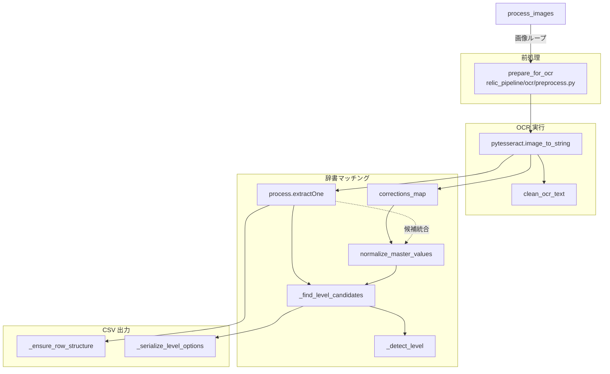

# OCR パイプライン段階的リファクタリング計画

## 1. 現行パイプラインの責務境界
（現在は削除済みの）`match_and_export.py` の主要関数を再読し、前処理・OCR・辞書マッチング・CSV 出力の責務を以下のように切り分ける。



- **前処理境界**: `ocr_and_match` 内で `prepare_for_ocr` がクロップ画像をグレースケール化・リサイズし、`preprocess` フラグでバイパス可能。
- **OCR 境界**: 前処理済み `ocr_input` を `pytesseract.image_to_string` に渡し、`clean_ocr_text` で整形した文字列がマッチング層へ流れる。
- **辞書マッチング境界**: `process.extractOne` で `dictionary` から最良候補を取得し、`corrections_map` のフォールバック、レベル判定 (`_find_level_candidates` / `_detect_level`) を実行。
- **CSV 出力境界**: `process_images` が `row` を組み立て、`_ensure_row_structure`・`_serialize_level_options` など補助関数で列定義・レベル候補を書き込む。

## 2. 将来ディレクトリ／モジュール案と関数シグネチャ
段階的な責務分割を見据え、以下のようなディレクトリ構成と関数シグネチャを提案する。

```
relic_pipeline/
  ocr/
    reader.py
    preprocess.py
  matching/
    effects.py
    levels.py
  io/
    exporter.py
    corrections.py
  cli/
    commands.py
```

### `ocr/preprocess.py`
```python
def prepare_for_ocr(image: np.ndarray, *, resize_scale: float, apply_threshold: bool, denoise: bool) -> np.ndarray:
    """入力画像を OCR 向けに整形する。旧来のクロップ前処理ロジックを集約。"""
```

### `ocr/reader.py`
```python
def recognize_effect_text(image: np.ndarray, *, lang: str, config: str) -> str:
    """単一スロットの画像から OCR テキストを取得して整形する。"""
```
```python
def batch_recognize(crops: Sequence[np.ndarray], *, settings: OCRSettings) -> list[str]:
    """バッチで OCR を実行し、整形済み文字列のリストを返す。"""
```

### `matching/effects.py`
```python
def find_best_effect(text: str, *, dictionary: Sequence[str], scorer: Callable[[str, str], int]) -> MatchResult:
    """OCR テキストに最も近い効果候補を返す。"""
```
```python
def apply_corrections(text: str, *, corrections: Mapping[str, str], default_score: float) -> MatchResult | None:
    """フィードバック辞書を優先し、該当する場合は補正結果を返す。"""
```
```python
def resolve_effect(text: str, *, settings: MatchingSettings) -> MatchResult:
    """補正辞書と辞書マッチングを統合して最適候補を返す。"""
```

### `matching/levels.py`
```python
def find_level_candidates(effect_name: str, *, level_map: Mapping[str, Sequence[str]]) -> Sequence[str]:
    """効果名から候補レベルを取得する。"""
```
```python
def detect_level_from_text(raw_text: str, *, candidates: Sequence[str]) -> str | None:
    """OCR テキストからレベル候補を確定する。"""
```

### `io/exporter.py`
```python
def build_row(image_name: str, matches: Sequence[MatchResult], *, options: ExportOptions) -> dict[str, Any]:
    """1 画像ぶんの CSV 行を構築する。"""
```
```python
def write_csv(rows: Iterable[Mapping[str, Any]], *, path: Path, column_flags: Mapping[str, bool]) -> None:
    """CSV を書き出す I/O 処理を担う。"""
```

### `io/corrections.py`
```python
def load_corrections(path: Path | None) -> dict[str, str]:
    """フィードバック CSV を読み込み、OCR テキスト→補正語のマップを返す。"""
```

### `cli/commands.py`
```python
def process_images_command(args: Namespace) -> int:
    """CLI から呼ばれるエントリポイント。段階的に `process_images` を置き換える。"""
```

## 3. フォールバック戦略と段階的差し替え

1. **前処理層の置き換え**: `ocr/preprocess.prepare_for_ocr` を単一の前処理エントリーポイントとし、従来のラッパー関数を廃止して直接呼び出す。既存引数は `prepare_for_ocr(image, resize_scale, ...)` に統一し、`settings` オブジェクト導入は後段に回す。
2. **OCR 層の抽象化**: `ocr_and_match` 内の `pytesseract` 呼び出しを `ocr/reader.recognize_effect_text` へ委譲し、`batch_recognize` が返すテキスト列を `MatchResult` のリストとして扱う。最終的に CLI 層から新モジュールを呼び出す構造へ移行する。
3. **辞書マッチング層の分割**: `matching/effects` と `matching/levels` を導入し、`process_images` 内の候補検索とレベル解析ロジックを移管。`MatchResult` データクラスを導入し、既存の辞書・補正マップ・スコア計算を集約。
4. **CSV 出力層の抽出**: `process_images` の `row` 組み立てと CSV 書き出し処理を `io/exporter` へ切り出し、列可視化設定 (`column_visibility`) を `ExportOptions` に集約。列フラグの変換は `parse_column_flag_value` で一元化。

### 共有設定の扱い
- `OCRSettings`, `MatchingSettings`, `ExportOptions` などのデータクラスを `relic_pipeline/settings.py` に用意し、段階的に既存関数へ注入する。
- 既存 CLI（旧 `match_and_export.py` の引数）は新しい設定オブジェクトへ変換するアダプタで吸収し、現在は `relic_pipeline/cli/main.py` から `relic_pipeline.cli.commands.process_images_command` を直接呼び出す構成へ移行済み。

### 段階的差し替え順とフォールバック
- **Step 1: 前処理** — `prepare_for_ocr` を新モジュールの公開関数として据え、従来のラッパーを除去して直接利用する。
- **Step 2: OCR** — `ocr_and_match` を `batch_recognize` ベースに改修し、戻り値を `MatchResult` のシーケンスへ統一。CSV ロジックは `MatchResult` を直接消費し、必要に応じて `MatchResult.to_dict()` を呼び出す。
- **Step 3: マッチング** — `find_best_effect` 等に処理を委譲し、旧ロジックを呼ぶラッパー関数で API 互換性を確保。`process.extractOne` のスコアリングは新モジュールから呼び出し、テスト整備後に旧実装を廃止。
- **Step 4: 出力** — `process_images` の CSV 組み立てを `io/exporter` へ移譲。旧関数は `build_row` / `write_csv` を呼ぶ構造に切り替え、CLI からの呼び出しシグネチャを変更せずに差し替える。列表示フラグは共通関数 `parse_column_flag_value` で CLI／GUI 双方の入力を正しく解釈する。

各ステップで既存 API (`process_images`, `ocr_and_match`) は旧引数・戻り値を維持したラッパーとして残し、内部実装を新モジュールへ委譲することで段階的移行を可能にする。

## 4. 実施状況メモ（2025-11-02 更新）
- Step 1 〜 Step 4 を実装済み。`relic_pipeline/ocr`, `matching`, `io`、`settings` を新設し、既存関数から新モジュールへ委譲する構造に切り替えた。
- `ocr_and_match` は `prepare_for_ocr` を直接呼び出し、`batch_recognize` の結果を `MatchResult` として返却するよう整理した。`process_images` はこのシーケンスを直接 `build_row` へ渡す構造となった。
- CSV 組み立てと書き出しは `relic_pipeline.io.exporter` へ移行し、`process_images` は `ExportOptions` を介して行単位に委譲する。
- CLI 層を切り出すため `relic_pipeline/cli/commands.py` を新設し、`build_arg_parser` / `main` は `relic_pipeline/cli/main.py` で保持する構成に移行。列表示デフォルトは `relic_pipeline.settings.DEFAULT_COLUMN_VISIBILITY` に集約し、`tests/cli/test_commands.py` で CLI の引数処理を検証。
- 次のステップ候補: CLI コマンドを GUI エントリ（`python -m gui`）など他エントリから再利用できるようアダプタ層を整備、`matching/levels` のユニットテスト追加、`MatchResult` ベースの API を GUI 側へ展開し、辞書補正レイヤーの単体テストを強化。
- 2025-11-01: `relic_pipeline.io.exporter` に `parse_column_flag_value` を追加し、`normalize_column_visibility` と CLI の列表示フラグ処理を共通化。文字列や数値で渡されたフラグも期待通りに反映されることを `tests/cli/test_commands.py` で確認。
- 2025-11-02: `relic_pipeline.matching.effects.resolve_effect` を追加し、補正辞書と辞書マッチングの統合を一箇所に集約。互換ラッパー経由の呼び出しを廃し、`relic_pipeline.processing.ocr_and_match` から直接呼び出す流れに整理済み。テストは `resolve_effect` ベースに更新し、補正優先ロジックの回帰を防止。
- 2025-11-03: 計画全体を再確認し、コードベースが Step 1〜4 の完了状態を維持していることを確認。追加のリファクタリング作業は現時点で不要と判断した。
