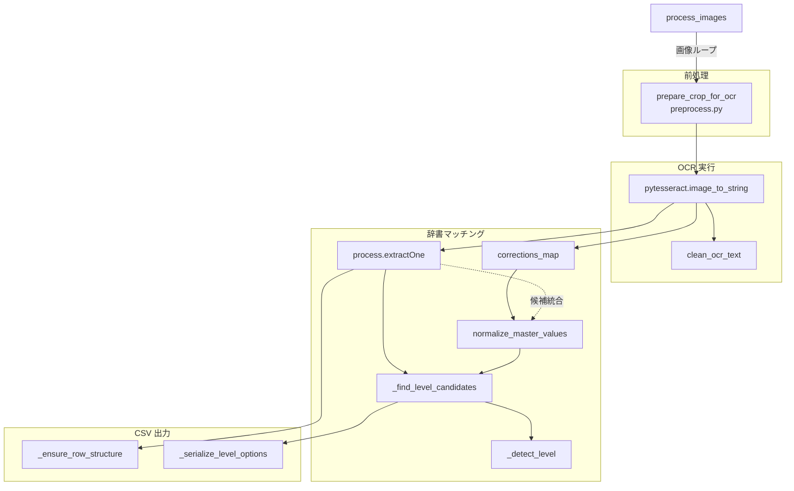

# OCR パイプライン段階的リファクタリング計画

## 1. 現行パイプラインの責務境界
`match_and_export.py` の主要関数を再読し、前処理・OCR・辞書マッチング・CSV 出力の責務を以下のように切り分ける。



- **前処理境界**: `ocr_and_match` 内で `prepare_crop_for_ocr` がクロップ画像をグレースケール化・リサイズし、`preprocess` フラグでバイパス可能。
- **OCR 境界**: 前処理済み `ocr_input` を `pytesseract.image_to_string` に渡し、`clean_ocr_text` で整形した文字列がマッチング層へ流れる。
- **辞書マッチング境界**: `process.extractOne` で `dictionary` から最良候補を取得し、`corrections_map` のフォールバック、レベル判定 (`_find_level_candidates` / `_detect_level`) を実行。
- **CSV 出力境界**: `process_images` が `row` を組み立て、`_ensure_row_structure`・`_serialize_level_options` など補助関数で列定義・レベル候補を書き込む。

## 2. 将来ディレクトリ／モジュール案と関数シグネチャ
段階的な責務分割を見据え、以下のようなディレクトリ構成と関数シグネチャを提案する。

```
relic_pipeline/
  ocr/
    reader.py
    preprocess.py
  matching/
    effects.py
    levels.py
  io/
    exporter.py
    corrections.py
  cli/
    commands.py
```

### `ocr/preprocess.py`
```python
def prepare_for_ocr(image: np.ndarray, *, resize_scale: float, apply_threshold: bool, denoise: bool) -> np.ndarray:
    """入力画像を OCR 向けに整形する。既存の `prepare_crop_for_ocr` の主要処理を移設。"""
```

### `ocr/reader.py`
```python
def recognize_effect_text(image: np.ndarray, *, lang: str, config: str) -> str:
    """単一スロットの画像から OCR テキストを取得して整形する。"""
```
```python
def batch_recognize(crops: Sequence[np.ndarray], *, settings: OCRSettings) -> list[str]:
    """バッチで OCR を実行し、整形済み文字列のリストを返す。"""
```

### `matching/effects.py`
```python
def find_best_effect(text: str, *, dictionary: Sequence[str], scorer: Callable[[str, str], int]) -> MatchResult:
    """OCR テキストに最も近い効果候補を返す。"""
```
```python
def apply_corrections(text: str, *, corrections: Mapping[str, str], default_score: float) -> MatchResult | None:
    """フィードバック辞書を優先し、該当する場合は補正結果を返す。"""
```

### `matching/levels.py`
```python
def find_level_candidates(effect_name: str, *, level_map: Mapping[str, Sequence[str]]) -> Sequence[str]:
    """効果名から候補レベルを取得する。"""
```
```python
def detect_level_from_text(raw_text: str, *, candidates: Sequence[str]) -> str | None:
    """OCR テキストからレベル候補を確定する。"""
```

### `io/exporter.py`
```python
def build_row(image_name: str, matches: Sequence[MatchResult], *, options: ExportOptions) -> dict[str, Any]:
    """1 画像ぶんの CSV 行を構築する。"""
```
```python
def write_csv(rows: Iterable[Mapping[str, Any]], *, path: Path, column_flags: Mapping[str, bool]) -> None:
    """CSV を書き出す I/O 処理を担う。"""
```

### `io/corrections.py`
```python
def load_corrections(path: Path | None) -> dict[str, str]:
    """フィードバック CSV を読み込み、OCR テキスト→補正語のマップを返す。"""
```

### `cli/commands.py`
```python
def process_images_command(args: Namespace) -> int:
    """CLI から呼ばれるエントリポイント。段階的に `process_images` を置き換える。"""
```

## 3. フォールバック戦略と段階的差し替え

1. **前処理層の置き換え**: `prepare_crop_for_ocr` を `ocr/preprocess.prepare_for_ocr` へ移設し、旧関数は新実装を呼ぶ薄いラッパーとして残す。既存 API (`prepare_crop_for_ocr(crop, resize_scale, ...)`) の引数互換を維持し、`settings` オブジェクト導入は後段に回す。
2. **OCR 層の抽象化**: `ocr_and_match` 内の `pytesseract` 呼び出しを `ocr/reader.recognize_effect_text` へ委譲。旧 `ocr_and_match` は `batch_recognize` を利用しつつ戻り値整形のみ担当し、最終的に CLI 層から新モジュールを呼び出す構造へ移行する。
3. **辞書マッチング層の分割**: `matching/effects` と `matching/levels` を導入し、`process_images` 内の候補検索とレベル解析ロジックを移管。`MatchResult` データクラスを導入し、既存の辞書・補正マップ・スコア計算を集約。
4. **CSV 出力層の抽出**: `process_images` の `row` 組み立てと CSV 書き出し処理を `io/exporter` へ切り出し、列可視化設定 (`column_visibility`) を `ExportOptions` に集約。

### 共有設定の扱い
- `OCRSettings`, `MatchingSettings`, `ExportOptions` などのデータクラスを `relic_pipeline/settings.py` に用意し、段階的に既存関数へ注入する。
- 既存 CLI (`match_and_export.py` 内の引数) はこれら設定に変換して渡すアダプタを用意。環境変数・コマンドライン引数処理は当面 `match_and_export.py` に残し、最終的に `cli/commands.py` へ移行する。

### 段階的差し替え順とフォールバック
- **Step 1: 前処理** — `prepare_crop_for_ocr` を新モジュールへ移し、旧関数は新関数呼び出しのラッパーとして維持。
- **Step 2: OCR** — `ocr_and_match` を `batch_recognize` ベースに改修しつつ旧シグネチャを保持。戻り値構造（辞書のリスト）は既存 CSV ロジックが消費するため当面維持する。
- **Step 3: マッチング** — `find_best_effect` 等に処理を委譲し、旧ロジックを呼ぶラッパー関数で API 互換性を確保。`process.extractOne` のスコアリングは新モジュールから呼び出し、テスト整備後に旧実装を廃止。
- **Step 4: 出力** — `process_images` の CSV 組み立てを `io/exporter` へ移譲。旧関数は `build_row` / `write_csv` を呼ぶ構造に切り替え、CLI からの呼び出しシグネチャを変更せずに差し替える。

各ステップで既存 API (`process_images`, `ocr_and_match`) は旧引数・戻り値を維持したラッパーとして残し、内部実装を新モジュールへ委譲することで段階的移行を可能にする。

## 4. 実施状況メモ（2025-10-31）
- Step 1 〜 Step 4 を実装済み。`relic_pipeline/ocr`, `matching`, `io`、`settings` を新設し、既存関数から新モジュールへ委譲する構造に切り替えた。
- `preprocess.prepare_crop_for_ocr` は新しい `prepare_for_ocr` を呼ぶラッパーとして維持し、`ocr_and_match` は `batch_recognize` と `MatchResult` に基づく実装へ更新済み。
- CSV 組み立てと書き出しは `relic_pipeline.io.exporter` へ移行し、`process_images` は `ExportOptions` を介して行単位に委譲する。
- CLI 層を切り出すため `relic_pipeline/cli/commands.py` を新設。`match_and_export.py` に `build_arg_parser` / `main` を追加し、既存処理を `process_images_command` から呼び出す構成へ整理。列表示デフォルトは `relic_pipeline.settings.DEFAULT_COLUMN_VISIBILITY` に集約し、`tests/cli/test_commands.py` で CLI の引数処理を検証。
- 次のステップ候補: CLI コマンドを `gui_app.py` など他エントリから再利用できるようアダプタ層を整備、`matching/levels` のユニットテスト追加、設定データクラスを `match_and_export.process_images` の引数へ順次導入。
